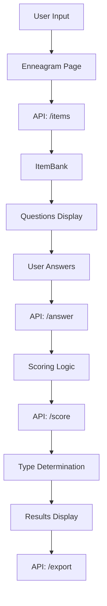

# Enneagram Module Architecture

## Overview
This document maps the current implementation of the Enneagram module across the LifeCraft application.

## Current File Locations

### Frontend Components
```
lifecraft-bot/
├── src/
│   ├── app/
│   │   └── discover/
│   │       └── enneagram/
│   │           └── page.tsx                 # Main Enneagram discovery page
│   └── components/
│       └── [Enneagram visualizations to be added]
```

### Backend/API Components
```
lifecraft-bot/
├── src/
│   ├── app/
│   │   └── api/
│   │       └── enneagram/
│   │           ├── answer/
│   │           │   └── route.ts            # Process assessment answers
│   │           ├── score/
│   │           │   └── route.ts            # Calculate Enneagram scores
│   │           ├── export/
│   │           │   └── route.ts            # Export Enneagram results
│   │           └── items/
│   │               └── route.ts            # Get assessment items/questions
│   └── lib/
│       └── enneagram/
│           ├── scoring.ts                  # Scoring algorithms
│           ├── discriminators.ts           # Type discrimination logic
│           ├── itemBank.ts                 # Question bank management
│           └── instincts.ts                # Instinctual variants logic
```

## Module Boundaries

### Core Domain Logic
- **Location**: `/lib/enneagram/`
- **Purpose**: Business logic for Enneagram type determination
- **Components**:
  - `scoring.ts`: Type scoring algorithms
  - `discriminators.ts`: Fine-tune type identification
  - `itemBank.ts`: Assessment question management
  - `instincts.ts`: Instinctual stacking determination

### UI Components
- **Location**: `/src/app/discover/enneagram/`
- **Purpose**: User interface for Enneagram assessment
- **Current State**: Basic page implementation

### API Layer
- **Location**: `/src/app/api/enneagram/`
- **Purpose**: HTTP endpoints for Enneagram operations
- **Endpoints**:
  - `/answer`: Process user responses
  - `/score`: Calculate type scores
  - `/export`: Export results
  - `/items`: Retrieve questions

## Data Flow



## Key Interfaces

### Enneagram Data Models
```typescript
interface EnneagramSession {
  sessionId: string;
  stage: 'screener' | 'discriminators' | 'wings' | 'narrative' | 'complete';
  responses: {
    stage1: number[];
    stage2: number[];
    stage3: number[];
    texts: string[];
  };
  typeScores: Record<string, number>;
}

interface EnneagramType {
  number: 1 | 2 | 3 | 4 | 5 | 6 | 7 | 8 | 9;
  name: string;
  title: string;
  core_motivation: string;
  core_fear: string;
  stress_point: number;
  growth_point: number;
}

interface EnneagramProfile {
  primaryType: number;
  wing: number;
  instinctualStack: string[];
  tritype: string;
  confidence: number;
}
```

### Assessment Flow
```typescript
interface AssessmentStage {
  name: string;
  questions: Question[];
  minResponses: number;
  nextStage: string | null;
}

interface Question {
  id: string;
  text: string;
  type: 'likert' | 'ranking' | 'binary';
  relatedTypes: number[];
  weight: number;
}

interface Response {
  questionId: string;
  value: number | string;
  timestamp: Date;
}
```

## Integration Points

### With Database (Prisma)
```typescript
// Current implementation in routes
import { prisma } from '@/lib/prisma';

// Database operations
const session = await prisma.enneagramSession.findUnique({
  where: { sessionId }
});
```

### With Scoring System
- Multi-stage assessment process
- Weighted scoring based on question relevance
- Discriminator questions for close types
- Instinctual variant determination

### With Export System
- Generate PDF/JSON reports
- Include type descriptions
- Provide growth recommendations
- Export session history

## Development Entry Points

### To work on Enneagram assessment:
1. Navigate to `/lifecraft-bot/src/app/discover/enneagram/`
2. Run `npm run dev` in `/lifecraft-bot/`
3. Access at `http://localhost:3000/discover/enneagram`

### To work on scoring logic:
1. Edit files in `/lifecraft-bot/src/lib/enneagram/`
2. Key files:
   - `scoring.ts`: Modify scoring algorithms
   - `itemBank.ts`: Add/edit questions
   - `discriminators.ts`: Adjust type discrimination

### To modify API endpoints:
1. Navigate to `/lifecraft-bot/src/app/api/enneagram/`
2. Follow Next.js App Router conventions
3. Each folder represents an endpoint

## Environment Variables
```
# Required for Enneagram module
DB_ENABLED=true                    # Enable database operations
DATABASE_URL=postgresql://...      # PostgreSQL connection
```

## Assessment Stages

### Stage 1: Screener
- 45-90 questions from item bank
- Initial type determination
- Broad personality assessment

### Stage 2: Discriminators
- Targeted questions for close types
- Refine type identification
- Typically 10-20 questions

### Stage 3: Wings
- Determine dominant wing
- Questions about adjacent types
- 5-10 questions

### Stage 4: Narrative
- Open-ended questions
- Validate type selection
- Optional stage

### Stage 5: Instincts
- Determine instinctual stacking
- Self-preservation, Social, Sexual
- 15-20 questions

## Testing Approach

### Unit Tests
```typescript
// Test scoring logic
describe('EnneagramScoring', () => {
  test('calculates type scores correctly', () => {
    // Test implementation
  });
});

// Test discriminators
describe('TypeDiscriminators', () => {
  test('distinguishes between close types', () => {
    // Test implementation
  });
});
```

### Integration Tests
- Test complete assessment flow
- Verify API endpoints
- Check database operations

### Manual Testing
- Complete assessment flow
- Verify type determination accuracy
- Check edge cases (tied scores, etc.)

## Performance Considerations

### Caching Strategy
- Cache question bank in memory
- Store session data temporarily
- Cache type descriptions

### Optimization Points
- Lazy load questions by stage
- Batch database operations
- Minimize API calls

## Future Migration Path

### Phase 1: Enhance Core Logic
- Improve scoring algorithms
- Add more discriminator questions
- Implement tritype calculation

### Phase 2: Add Visualizations
- Enneagram symbol visualization
- Type relationship diagrams
- Growth path visualizations

### Phase 3: Module Independence
- Extract as standalone package
- Create Enneagram-specific database
- Implement comprehensive API

## Module Dependencies

### Internal Dependencies
- `@/lib/prisma`: Database client
- `@/types`: Shared TypeScript types

### External Dependencies
- `next`: Framework
- `@prisma/client`: Database ORM
- React components

## Security Considerations

### Data Privacy
- Session data encryption
- Anonymous assessment option
- GDPR compliance for results

### Input Validation
- Validate all user responses
- Sanitize text inputs
- Rate limiting on API endpoints