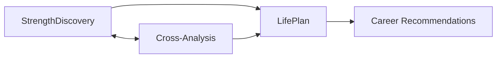

# 🧩 LifeCraft Modules

**Last Updated:** September 11, 2025  
**Purpose:** Core feature modules for the LifeCraft platform

---

## 📁 Module Structure

```
Modules/
├── 📁 StrengthDiscovery/      ← Strength assessment & visualization
│   ├── README.md              ← Module overview
│   ├── database-schema.sql    ← PostgreSQL schema
│   ├── data-retrieval-patterns.md ← Data patterns
│   ├── strength_discovery_conversation_flow.md ← AI flow
│   ├── StrengthHexagon.tsx   ← React component
│   ├── StrengthRadarChart.tsx ← React component
│   └── StrengthMindMap.tsx   ← React component
│
├── 📁 Enneagram/              ← Personality type assessment
│   ├── README.md              ← Module overview
│   ├── Enneagram_Test_Plan.md ← Testing strategy
│   ├── database-schema.sql    ← PostgreSQL schema
│   └── data-retrieval-patterns.md ← Data patterns
│
└── README.md                   ← This file
```

---

## 🎯 Module Overview

### StrengthDiscovery Module
**Status:** In Development (Visualizations Complete)

Helps users identify and develop their core strengths through:
- AI-powered conversational assessment
- Interactive strength visualizations (Hexagon, Radar, Mind Map)
- Personalized strength insights and recommendations
- Progress tracking over time

**Key Files:**
- React Components: 3 visualization components ready for integration
- Database Schema: Complete schema for strength data storage
- Conversation Flow: AI assessment conversation design

### Enneagram Module
**Status:** Planning Phase

Provides personality type assessment based on the Enneagram system:
- Nine personality types with core motivations and fears
- Wing analysis and integration patterns
- Growth paths and stress patterns
- Team dynamics and compatibility insights

**Key Files:**
- Test Plan: Comprehensive testing strategy
- Database Schema: Complete schema for Enneagram data
- Data Patterns: Caching and retrieval strategies

---

## 🔗 Module Integration

### How Modules Work Together



1. **StrengthDiscovery + Enneagram**: Cross-reference strengths with personality types for deeper insights
2. **Both → LifePlan**: Combined insights feed into personalized life and career planning
3. **Shared Database**: Unified user profiles across all modules

---

## 💻 Development Guide

### For Jonathan (Database)
Focus areas in these modules:
1. Review `database-schema.sql` in both modules
2. Implement schemas in PostgreSQL
3. Create data migration scripts
4. Design cross-module data relationships

### For Trivikram (RAG)
Focus areas in these modules:
1. Process module documentation for RAG
2. Create embeddings for assessment questions
3. Build retrieval for personalized insights
4. Implement conversation flows

### Using Module Components

```typescript
// Example: Importing Strength Discovery components
import { StrengthRadarChart } from '@/modules/StrengthDiscovery/StrengthRadarChart';

// Example: Using in a page
export default function StrengthsPage() {
  return (
    <StrengthRadarChart 
      data={userStrengths}
      options={chartOptions}
    />
  );
}
```

---

## 📊 Database Integration

### Shared User Context
Both modules share a common user context:

```sql
-- Core user table (shared)
CREATE TABLE users (
  id UUID PRIMARY KEY,
  email VARCHAR(255) UNIQUE,
  created_at TIMESTAMP
);

-- Module-specific extensions
-- See individual database-schema.sql files
```

### Data Relationships
- One user → Many strength assessments
- One user → One primary Enneagram type
- Cross-module insights table for integrated analysis

---

## 🚀 Quick Start

### 1. Choose Your Module
- Working on strengths? → `/Modules/StrengthDiscovery/`
- Working on Enneagram? → `/Modules/Enneagram/`

### 2. Review Core Files
- Start with module `README.md`
- Check `database-schema.sql` for data structure
- Review `data-retrieval-patterns.md` for best practices

### 3. Implement Features
- Database: Apply schemas using provided SQL files
- Frontend: Import and use React components
- Backend: Follow API endpoint specifications

---

## 📝 Module Standards

### File Organization
- `README.md` - Module overview and quick start
- `database-schema.sql` - PostgreSQL schema definitions
- `data-retrieval-patterns.md` - Data access patterns
- Component files (`.tsx`) - React components
- Flow documents (`.md`) - Process and conversation flows

### Naming Conventions
- Components: PascalCase (e.g., `StrengthRadarChart`)
- Database tables: snake_case (e.g., `user_strengths`)
- API endpoints: kebab-case (e.g., `/api/strength-discovery`)

### Documentation Requirements
- Every module must have a README
- Database schemas must include comments
- Components must have TypeScript interfaces
- API endpoints must specify request/response formats

---

## 📚 Resources

### Module Documentation
- Architecture Overview: `/Collaboration/02-Technical-Docs/`
- Integration Guide: `/Collaboration/02-Technical-Docs/CODE_MAP.md`
- Development Tasks: `/Collaboration/03-Tasks/`

### External Resources
- [Enneagram Institute](https://www.enneagraminstitute.com/) - Type descriptions
- [VIA Character Strengths](https://www.viacharacter.org/) - Strength assessment reference
- [PostgreSQL Docs](https://www.postgresql.org/docs/) - Database reference

---

**Questions about modules?** Check individual module READMEs or ask in Slack.  
**Ready to build?** Pick a module and start with its README! 🚀