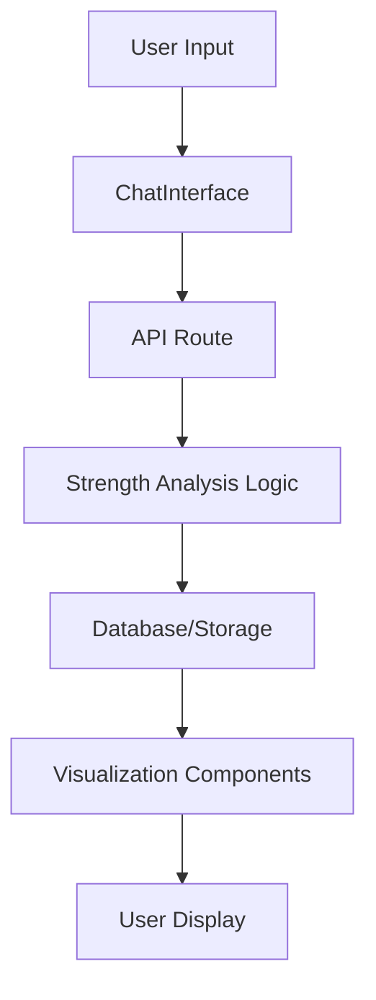

# StrengthDiscovery Module Architecture

## Overview
This document maps the current implementation of the StrengthDiscovery module across the LifeCraft application.

## Current File Locations

### Frontend Components
```
lifecraft-bot/
├── src/
│   ├── app/
│   │   └── discover/
│   │       └── strengths/
│   │           └── page.tsx                 # Main strengths discovery page
│   ├── components/
│   │   ├── ChatInterface.tsx                # Chat interface using strength visualizations
│   │   └── visualization/
│   │       ├── StrengthHexagon.tsx         # Hexagonal strength visualization
│   │       ├── StrengthMindMap.tsx         # Mind map visualization
│   │       └── StrengthRadarChart.tsx      # Radar chart for strength profiles
│   └── app/
│       └── results/
│           └── page.tsx                     # Results page showing strength analysis
```

### Backend/API Components
```
lifecraft-bot/
├── src/
│   ├── app/
│   │   └── api/
│   │       └── chat/                       # Chat API handling strength-related queries
│   │           └── stream/
│   └── lib/
│       └── services/                       # Shared services for strength analysis
```

### Documentation
```
lifecraft-bot/
└── docs/
    └── strength_discovery_conversation_flow.md  # Conversation flow documentation
```

## Module Boundaries

### Core Domain Logic
- **Location**: Would be in `/lib/strengths/` (to be created)
- **Purpose**: Business logic for strength assessment and analysis
- **Current State**: Embedded in components and API routes

### UI Components
- **Location**: `/src/components/visualization/`
- **Purpose**: Visual representations of strength data
- **Dependencies**: React, D3.js, Chart.js

### API Layer
- **Location**: `/src/app/api/`
- **Purpose**: HTTP endpoints for strength operations
- **Current Implementation**: Integrated with chat API

## Data Flow



## Key Interfaces

### Strength Data Model
```typescript
interface UserStrength {
  id: string;
  userId: string;
  strengthId: string;
  score: number;
  confidence: number;
  rank: number;
  assessmentDate: Date;
}

interface StrengthProfile {
  userId: string;
  topStrengths: UserStrength[];
  strengthCategories: Map<string, UserStrength[]>;
  overallConfidence: number;
}
```

### Component Props
```typescript
// StrengthRadarChart props
interface RadarChartProps {
  strengths: UserStrength[];
  showLegend?: boolean;
  interactive?: boolean;
}

// StrengthHexagon props
interface HexagonProps {
  strengths: UserStrength[];
  size?: 'small' | 'medium' | 'large';
  animated?: boolean;
}
```

## Integration Points

### With ChatInterface
- Strength assessment through conversational UI
- Real-time visualization updates
- Progressive disclosure of insights

### With Results Page
- Comprehensive strength profile display
- Export functionality
- Historical comparison

### With Database
- User strength profiles stored in PostgreSQL
- Session-based temporary storage
- Cache layer for performance

## Development Entry Points

### To work on strength visualization:
1. Navigate to `/lifecraft-bot/src/components/visualization/`
2. Run `npm run dev` in `/lifecraft-bot/`
3. Access at `http://localhost:3000/discover/strengths`

### To work on strength logic:
1. Create new files in `/lifecraft-bot/src/lib/strengths/` (new)
2. Implement core logic separate from UI
3. Connect through API routes

### To modify API endpoints:
1. Check `/lifecraft-bot/src/app/api/`
2. Follow Next.js App Router conventions
3. Test with API client or frontend

## Environment Variables
```
# Required for strength module
DB_ENABLED=true                    # Enable database operations
OPENAI_API_KEY=xxx                 # For AI-powered strength analysis
```

## Testing Approach

### Unit Tests
- Location: `/lifecraft-bot/__tests__/strengths/`
- Test strength calculation logic
- Test data transformations

### Integration Tests
- Test API endpoints
- Test database operations
- Test visualization rendering

### E2E Tests
- Complete strength discovery flow
- User interaction with visualizations
- Data persistence verification

## Deployment Considerations

### Build Process
- Visualization components bundled with Next.js
- Static optimization for performance
- API routes as serverless functions

### Performance
- Lazy load visualization libraries
- Cache strength calculations
- Optimize database queries

## Future Migration Path

### Phase 1: Extract Core Logic
- Move business logic to `/lib/strengths/`
- Create clear interfaces
- Maintain backward compatibility

### Phase 2: Modularize Components
- Create strength-specific component library
- Implement proper separation of concerns
- Add comprehensive testing

### Phase 3: Module Independence
- Move to Modules/StrengthDiscovery/
- Implement as standalone package
- Use module federation or workspace