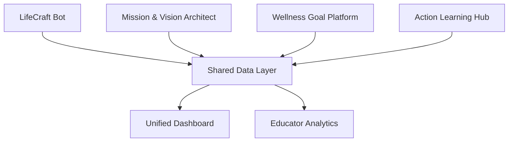

# WFED 119 Integrated Services Workflow
**Career Planning and Life Design - Fall 2025**  
**Collaborative AI-Enhanced Learning Platform**

---

## 🎯 Project Overview

**Vision**: Create an integrated ecosystem of AI-powered tools that support students throughout their WFED 119 journey, from strength discovery to career planning and action learning implementation.

**Mission**: Develop specialized AI services that address different aspects of the course learning objectives while maintaining coherence through shared data and unified user experience.

---

## 📚 Course Context Analysis

### Core Learning Dimensions
Based on the WFED 119 syllabus, students need support across three main dimensions:

#### 🔍 **Dimension 1: Multiple Perceptions of Health and Wellness**
- Self-discovery and strength identification
- Life roles and responsibilities analysis
- Holistic well-being integration

#### ⚖️ **Dimension 2: Achievement and Maintenance of Wellness**
- Personal mission statement development
- Agency-based approaches (personal, proxy, collective)
- Meaningful narrative construction

#### ⚠️ **Dimension 3: Risk Factors and Behavioral Changes**
- Barrier identification and strategy development
- Goal setting and behavioral modification
- Organizational health challenge navigation

---

## 🏗️ Integrated Services Architecture

### Integrated App: LifeCraft (Unified)
**Status**: ✅ Pilot‑ready unified app  
**URL**: https://wfed119-1.onrender.com

What’s now inside one app (single Next.js codebase):
- Home Hub (`/`): entry to all modules; resume Results via `sessionId`.
- Strength Discovery (`/discover/strengths`): 5‑stage Socratic chat; Skills/Attitudes/Values extraction; visuals.
- Enneagram Profiler (`/discover/enneagram`): Screener → Discriminators → Instincts → Narrative → Score; EN/KR.
- Unified Results (`/results?sessionId=...`): Strengths + Enneagram (type distribution, primary, wing, instinct, confidence); export.

Technical notes (prod/dev parity):
- Framework: Next.js App Router, TypeScript, Tailwind; state: Zustand.
- AI: Anthropic Claude 3 Haiku primary, OpenAI fallback (env driven).
- Data: Prisma; dev SQLite; prod Postgres; enable persistence with `DB_ENABLED=true` + `DATABASE_URL`.
- i18n: EN primary, KR available in Enneagram items/prompts; plan to lift to app‑wide `next‑intl`.
- Privacy: session‑first; explicit consent planned for cross‑module reuse; export/delete controls.

---

### Backend Infrastructure Services

#### 🗄️ **Service 1: Intelligent Data Management System**
**Focus**: Centralized Database, RAG, and HILT Architecture (All CLOs)  
**Timeline**: Development Priority #0 (Foundation Layer)

**Features:**
- **Advanced Database Architecture**: Multi-tenant PostgreSQL with intelligent partitioning
- **RAG (Retrieval-Augmented Generation) System**: Document knowledge base with semantic search
- **HITL (Human In the Loop)**: Human-AI collaboration framework  
- **Real-time Data Synchronization**: Cross-service data consistency and conflict resolution

**Integration Points:**
- Foundational layer for all other services
- Provides semantic search capabilities across all student data
- Enables intelligent recommendations based on historical patterns
- Supports real-time collaboration and data sharing

---

### User-Facing Services

#### 🎯 **Service 2: Mission & Vision Architect**
**Focus**: Personal Mission Statement & Vision Creation (CLOs 4-6)  
**Timeline**: Development Priority #1

**Features:**
- **Values Exploration Engine**: Interactive values card sorting and prioritization
- **Mission Statement Generator**: AI-guided iterative mission statement creation
- **Vision Board Builder**: Digital vision board with goal visualization
- **Life Roles Mapping**: Interactive life roles and responsibilities assessment
- **RAG-Enhanced Guidance**: Contextual suggestions from career development literature

**Integration Points:**
- Import strengths data from LifeCraft Bot
- Export mission/vision to Goal Setting Platform
- Sync values with all other services
- Leverage RAG system for personalized career guidance

#### 📊 **Service 3: Wellness Goal Setting Platform**  
**Focus**: SMART Goal Creation & Tracking (CLOs 7-9)  
**Timeline**: Development Priority #2

**Features:**
- **SWOT Analysis Builder**: Interactive strength/weakness/opportunity/threat analysis
- **SMART Goal Constructor**: AI-assisted specific, measurable, achievable goal creation
- **Risk Assessment Matrix**: Potential barrier identification and mitigation planning
- **Progress Tracking Dashboard**: Visual progress monitoring with intervention suggestions
- **HILT Goal Optimization**: Human-AI collaborative goal refinement and achievement strategies
- **RAG-Powered Insights**: Evidence-based recommendations from wellness research literature

**Integration Points:**
- Receive strengths from LifeCraft Bot
- Import mission/vision from Mission & Vision Architect
- Feed goal data to Action Learning Hub
- Query RAG system for research-backed goal achievement strategies

#### 🚀 **Service 4: Action Learning Hub**
**Focus**: Team Project Collaboration & Implementation (CLOs 9-10)  
**Timeline**: Development Priority #3

**Features:**
- **Project Ideation Generator**: AI-powered project brainstorming based on team strengths
- **Action Learning Template Engine**: Structured Forms 1-9 completion system
- **Collaboration Workspace**: Real-time team coordination and document sharing
- **Impact Measurement Tools**: Evidence collection and outcome evaluation
- **HILT Project Management**: Human-AI collaborative project planning and execution
- **RAG-Enhanced Problem Solving**: Access to action learning methodology and case studies

**Integration Points:**
- Aggregate team member data from all previous services
- Provide implementation feedback to Goal Setting Platform
- Generate final portfolio content for all services
- Leverage RAG system for action learning best practices and methodology guidance

---

## 👥 Team Structure & Role Distribution

### Development Team Configuration

#### 🏗️ **Project Lead: Hosung You**
**Primary Focus**: Architecture, Integration, and Advanced Features
**Skills & Experience**: Full-stack development, AI integration, product management

**Responsibilities:**
- Overall technical architecture and system design
- Advanced AI services and prompt engineering
- Frontend development and user experience
- Mission & Vision Architect development (Service 2)
- Wellness Goal Setting Platform (Service 3)
- Action Learning Hub (Service 4)
- Production deployment and scaling
- Code reviews and technical mentorship

#### 🗄️ **Database Lead: Jonathan Alavez (Intern)**
**Primary Focus**: Service 1 - Intelligent Data Management System
**Learning Path**: PostgreSQL → Database Architecture → Performance Optimization

**Core Database Responsibilities:**
- **Authentication & User Management**:
  - User authentication schema design (users, sessions, tokens)
  - Role-based access control (RBAC) implementation
  - Session management and security
  - Password hashing and security best practices
- **User Information Storage**:
  - User profile schema (personal info, preferences, settings)
  - Course enrollment and progress tracking
  - Multi-tenant data isolation
  - GDPR-compliant data management
- **Core Schema Design**:
  - Unified data model for all services
  - Relationship mapping between entities
  - Data integrity constraints and validations
  - Audit logging and version tracking

**Week 1-2 Responsibilities:**
- **DB-01**: Set up PostgreSQL with Docker (Foundation)
- **DB-02**: Design complete schema including:
  - Users table with authentication fields
  - Sessions and tokens management
  - Role and permissions structure
  - User profiles and preferences
- Study existing Prisma schemas and migration patterns
- Learn PostgreSQL administration and optimization

**Week 3-4 Responsibilities:**
- **DB-03**: Build migrations system with focus on:
  - User data migration strategies
  - Schema versioning and rollback
  - Zero-downtime migrations
- **DB-04**: Create comprehensive seed scripts including:
  - Test users with different roles
  - Sample user profiles and settings
  - Authentication test scenarios
- Support RAG pipeline with metadata storage design
- Implement database performance monitoring

**Advanced Phase (Associate Role):**
- **DB-05**: Design read models optimized for:
  - User authentication queries
  - Profile data retrieval
  - RAG system queries
- **DB-06**: Implement backup strategies for:
  - User data protection
  - Authentication credentials
  - Compliance requirements
- **DB-07**: Add row-level security for:
  - User data isolation
  - Multi-tenant access control
  - FERPA/GDPR compliance

#### 🤖 **RAG Lead: Trivikram Sunil (Intern)**
**Primary Focus**: RAG Pipeline and Document Intelligence
**Learning Path**: Document Processing → Embeddings → Vector Search → AI Integration

**Week 1-2 Responsibilities:**
- **RAG-01**: Build document ingestion pipeline (PDF, DOCX, Markdown)
- **RAG-02**: Implement embeddings generation with OpenAI/local models
- Study LangChain and vector database concepts
- Create semantic chunking and metadata extraction

**Week 3-4 Responsibilities:**
- **RAG-03**: Set up Qdrant vector database with Docker
- **RAG-04**: Build retrieval API with semantic search
- Develop document preprocessing and normalization
- Implement relevance scoring and re-ranking

**Advanced Phase (Associate Role):**
- **RAG-05**: Add citation tracking and source attribution
- **RAG-06**: Create evaluation framework for retrieval quality
- **RAG-07**: Implement performance monitoring and cost tracking
- Integration with chat interface and AI services

### Cross-Functional Collaboration Model

#### **Lead-Associate Partnership**
- **Database Workstream**: Jonathan leads, Trivikram assists with RAG metadata needs
- **RAG Workstream**: Trivikram leads, Jonathan assists with data persistence
- **Integration Points**: Both collaborate on shared interfaces and data flow
- **Learning Exchange**: Weekly knowledge sharing sessions between workstreams

---

## 🛠️ Technical Integration Strategy

### Backend Infrastructure Architecture

#### 🗄️ **Database Infrastructure (Jonathan's Domain)**
```sql
-- Jonathan's Core Database Schema Design
-- Multi-tenant PostgreSQL with authentication and user management

CREATE SCHEMA wfed119_auth;    -- Authentication & authorization
CREATE SCHEMA wfed119_core;    -- Core application data
CREATE SCHEMA wfed119_rag;     -- RAG system data
CREATE SCHEMA wfed119_analytics; -- Analytics and reporting

-- Authentication tables (Jonathan's primary focus)
CREATE TABLE wfed119_auth.users (
  id UUID PRIMARY KEY DEFAULT gen_random_uuid(),
  email VARCHAR(255) UNIQUE NOT NULL,
  password_hash VARCHAR(255) NOT NULL,
  email_verified BOOLEAN DEFAULT false,
  created_at TIMESTAMP DEFAULT NOW(),
  updated_at TIMESTAMP DEFAULT NOW(),
  last_login TIMESTAMP,
  account_status VARCHAR(50) DEFAULT 'active' -- active, suspended, deleted
);

CREATE TABLE wfed119_auth.sessions (
  id UUID PRIMARY KEY DEFAULT gen_random_uuid(),
  user_id UUID REFERENCES wfed119_auth.users(id) ON DELETE CASCADE,
  token VARCHAR(255) UNIQUE NOT NULL,
  expires_at TIMESTAMP NOT NULL,
  ip_address INET,
  user_agent TEXT,
  created_at TIMESTAMP DEFAULT NOW()
);

CREATE TABLE wfed119_auth.roles (
  id UUID PRIMARY KEY DEFAULT gen_random_uuid(),
  name VARCHAR(50) UNIQUE NOT NULL, -- student, educator, admin
  permissions JSONB NOT NULL,
  created_at TIMESTAMP DEFAULT NOW()
);

CREATE TABLE wfed119_auth.user_roles (
  user_id UUID REFERENCES wfed119_auth.users(id) ON DELETE CASCADE,
  role_id UUID REFERENCES wfed119_auth.roles(id) ON DELETE CASCADE,
  assigned_at TIMESTAMP DEFAULT NOW(),
  PRIMARY KEY (user_id, role_id)
);

-- User profile and course data (Jonathan's extended schema)
CREATE TABLE wfed119_core.user_profiles (
  user_id UUID PRIMARY KEY REFERENCES wfed119_auth.users(id),
  first_name VARCHAR(100),
  last_name VARCHAR(100),
  preferred_name VARCHAR(100),
  student_id VARCHAR(50),
  course_section VARCHAR(50),
  locale VARCHAR(10) DEFAULT 'en',
  timezone VARCHAR(50) DEFAULT 'America/New_York',
  preferences JSONB, -- UI preferences, notification settings
  metadata JSONB,    -- Additional flexible data
  created_at TIMESTAMP DEFAULT NOW(),
  updated_at TIMESTAMP DEFAULT NOW()
);

-- Document vector storage for RAG (Trivikram's domain, Jonathan supports)
CREATE TABLE wfed119_rag.document_embeddings (
  id UUID PRIMARY KEY DEFAULT gen_random_uuid(),
  document_id UUID NOT NULL,
  content_chunk TEXT,
  embedding vector(1536), -- OpenAI/Claude embedding size
  metadata JSONB,
  document_type VARCHAR(50), -- research_paper, case_study, methodology
  created_by UUID REFERENCES wfed119_auth.users(id),
  created_at TIMESTAMP DEFAULT NOW()
);

-- Audit logging for compliance (Jonathan's security focus)
CREATE TABLE wfed119_core.audit_logs (
  id UUID PRIMARY KEY DEFAULT gen_random_uuid(),
  user_id UUID REFERENCES wfed119_auth.users(id),
  action VARCHAR(100) NOT NULL,
  entity_type VARCHAR(50),
  entity_id UUID,
  old_values JSONB,
  new_values JSONB,
  ip_address INET,
  timestamp TIMESTAMP DEFAULT NOW()
);

-- Indexes for performance (Jonathan's optimization work)
CREATE INDEX idx_users_email ON wfed119_auth.users(email);
CREATE INDEX idx_sessions_token ON wfed119_auth.sessions(token);
CREATE INDEX idx_sessions_expires ON wfed119_auth.sessions(expires_at);
CREATE INDEX idx_audit_user_timestamp ON wfed119_core.audit_logs(user_id, timestamp);
```

#### 🧠 **RAG (Retrieval-Augmented Generation) System**
```python
# Vector database with semantic search capabilities
class RAGKnowledgeBase:
    def __init__(self):
        self.vector_store = QdrantClient()  # or ChromaDB/Pinecone
        self.embeddings = OpenAIEmbeddings()
        
    async def ingest_documents(self, documents: List[Document]):
        """
        Ingest career development research, WFED course materials,
        Hope-Action Theory papers, wellness research, case studies
        """
        chunks = self.chunk_documents(documents)
        embeddings = await self.embeddings.embed_documents(chunks)
        await self.vector_store.upsert(chunks, embeddings)
        
    async def semantic_search(self, query: str, context: UserContext) -> List[RelevantContent]:
        """
        Context-aware semantic search that considers:
        - User's current stage in WFED journey
        - Previously identified strengths/values
        - Current goals and challenges
        """
        enhanced_query = self.enhance_query_with_context(query, context)
        results = await self.vector_store.similarity_search(enhanced_query)
        return self.rank_by_relevance(results, context)
        
    async def generate_contextual_response(self, query: str, user_context: UserContext) -> str:
        """
        RAG-enhanced response generation combining:
        - Semantic search results
        - User's personal data
        - Educational best practices
        """
        relevant_docs = await self.semantic_search(query, user_context)
        context = self.build_context(relevant_docs, user_context)
        return await self.llm.generate_response(query, context)
```

#### 🤝 **HILT (Hybrid Intelligence Learning Technology) Framework**  
```typescript
// Human-AI collaboration optimization
interface HILTCollaborationEngine {
  // Track human-AI interaction patterns
  analyzeCollaborationPatterns(userId: string): CollaborationProfile;
  
  // Optimize AI suggestions based on human preferences
  personalizeAIBehavior(userHistory: InteractionHistory): AIPersonalization;
  
  // Identify when human expertise should override AI
  detectHumanOverrideNeeded(context: DecisionContext): OverrideRecommendation;
  
  // Learn from human corrections and improvements
  incorporateHumanFeedback(aiSuggestion: AISuggestion, humanEdit: HumanEdit): LearningUpdate;
}

class HILTOptimization {
  // Real-time collaboration quality assessment
  async assessCollaborationQuality(interaction: HILTInteraction): Promise<QualityMetrics> {
    return {
      aiContribution: this.measureAIValueAdd(interaction),
      humanContribution: this.measureHumanValueAdd(interaction),
      synergyEffect: this.calculateSynergy(interaction),
      outcomeImprovement: this.measureOutcomeQuality(interaction)
    };
  }
  
  // Dynamic AI behavior adjustment
  async adaptAIBehavior(userProfile: HILTProfile): Promise<AIConfiguration> {
    if (userProfile.prefersMinimalAI) return this.getMinimalistConfig();
    if (userProfile.wantsActiveCollaboration) return this.getCollaborativeConfig();
    return this.getBalancedConfig();
  }
}
```

#### 🔐 **Enhanced Authentication & Context System**
```typescript
// Expanded user session with RAG/HILT context
interface EnhancedWFEDUser {
  id: string;
  email: string;
  courseSection: string;
  currentWeek: number;
  completedServices: ServiceId[];
  
  // Core user data
  sharedData: {
    strengths: StrengthAnalysis;
    values: ValuesProfile;
    mission: MissionStatement;
    goals: GoalSet[];
  };
  
  // RAG context
  knowledgeContext: {
    preferredLearningStyle: LearningStyle;
    domainExpertise: ExpertiseArea[];
    researcInterests: ResearchTopic[];
    contextualPreferences: ContextPreference[];
  };
  
  // HILT collaboration profile
  hiltProfile: {
    collaborationStyle: CollaborationPreference;
    aiReliance: AIRelianceLevel;
    overridePatterns: OverridePattern[];
    feedbackHistory: FeedbackHistory[];
  };
}
```

#### 📡 **Cross-Service Data API**
```typescript
// Service-to-service communication
interface ServiceAPI {
  importData(sourceService: ServiceId, dataType: DataType): Promise<any>;
  exportData(targetService: ServiceId, data: any): Promise<boolean>;
  syncUserProgress(userId: string, progress: Progress): Promise<void>;
}
```

#### 🗄️ **Shared Database Schema**
```sql
-- Centralized user data with service-specific extensions
CREATE TABLE users (
  id UUID PRIMARY KEY,
  email VARCHAR UNIQUE,
  course_data JSONB,
  created_at TIMESTAMP
);

CREATE TABLE service_data (
  user_id UUID REFERENCES users(id),
  service_name VARCHAR,
  data_type VARCHAR,
  content JSONB,
  updated_at TIMESTAMP
);
```

### Service Communication Pattern



---

## 📅 Development Timeline & Milestones

### Phase 1: Foundation (Weeks 1-4)
**Parallel Development Track**

**Week 1-2: Infrastructure Setup**
- [ ] Set up shared authentication system
- [ ] Design unified database schema  
- [ ] Create cross-service API framework
- [ ] Establish development environment and CI/CD

**Week 3-4: Core Development Begins**
- [ ] **Service 2**: Values exploration conversation engine
- [ ] **Service 3**: SWOT analysis interactive interface
- [ ] **Service 4**: Action learning template system
- [ ] **Analytics**: Basic outcome measurement framework

### Phase 2: Integration (Weeks 5-8) 
**Focus on Service Connectivity**

**Week 5-6: Data Flow Integration**
- [ ] Implement data import/export between services
- [ ] Create unified user dashboard
- [ ] Test cross-service authentication

**Week 7-8: Course Alignment Testing**
- [ ] Align services with WFED 119 weekly schedule
- [ ] Beta testing with select course assignments
- [ ] Educator feedback integration

### Phase 3: Production (Weeks 9-12)
**Full Deployment and Optimization**

**Week 9-10: Production Deployment** 
- [ ] Deploy all services to production
- [ ] Performance optimization and scaling
- [ ] Comprehensive user testing

**Week 11-12: Course Integration**
- [ ] Full integration with WFED 119 assignments
- [ ] Real-time support during action learning phase
- [ ] Impact measurement and data collection

---

## 🎯 Course Assignment Integration

### Week-by-Week Service Utilization

| Week | Course Focus | Primary Service | Integration Points |
|------|--------------|------------------|-------------------|
| 1-2 | Self-introduction, Strength finding | **LifeCraft Bot** | Complete strength discovery exercise |
| 3-4 | Hope-Action Theory, Skills/Values | **LifeCraft Bot** → **Mission Architect** | Transfer strengths to values exploration |
| 5-6 | Mission Statement, Roles | **Mission & Vision Architect** | Create personal mission statement |
| 7-8 | Visioning, Life as a Book | **Mission & Vision Architect** | Develop comprehensive vision statement |
| 9-10 | SWOT, Goal Setting | **Wellness Goal Platform** | Translate vision into SMART goals |
| 11-13 | Action Learning Implementation | **Action Learning Hub** | Team project coordination and tracking |
| 14-15 | Presentations, Integration | **All Services** | Portfolio compilation and reflection |

### Assignment Enhancement Examples

#### **Week 5: Mission Statement Assignment**
- **Traditional**: Write a personal mission statement (individual reflection)
- **Enhanced**: Use Mission & Vision Architect to iteratively develop mission statement through AI-guided values exploration and peer feedback

#### **Week 9: SWOT Analysis**
- **Traditional**: Complete SWOT analysis worksheet
- **Enhanced**: Interactive SWOT builder that imports strengths from LifeCraft Bot and suggests opportunities based on vision from Mission Architect

#### **Weeks 11-13: Action Learning Project**
- **Traditional**: Team forms, paper templates, manual tracking
- **Enhanced**: Full collaborative workspace with automated form generation, progress tracking, and evidence collection

---

## 📊 Success Metrics & Evaluation

### Student Experience Metrics
- **Engagement**: Time spent per service, completion rates
- **Learning Outcomes**: Pre/post assessments of self-awareness, goal clarity
- **Satisfaction**: User experience ratings, qualitative feedback
- **Integration**: Cross-service data utilization rates

### Educational Impact Metrics  
- **Course Performance**: Grade improvements, assignment quality
- **Retention**: Course completion rates, continued engagement
- **Skill Development**: Career readiness competency growth
- **Long-term Outcomes**: Post-course goal achievement tracking

### Technical Performance Metrics
- **Reliability**: Uptime, error rates, response times
- **Scalability**: Concurrent user support, peak load handling
- **Cost Efficiency**: AI API usage optimization, infrastructure costs
- **Security**: Data privacy compliance, access control effectiveness

---

## 🔄 Collaboration Workflow

### Development Coordination

#### **Daily Standups** (15 min, async via Discord/Slack)
- Progress updates from each collaborator
- Blockers and dependencies identification  
- Integration point coordination

#### **Weekly Integration Sessions** (60 min, video call)
- Cross-service compatibility testing
- User experience consistency review
- Course alignment validation

#### **Bi-weekly Stakeholder Reviews** (30 min)
- Demo latest features to Dr. Yoon (course instructor)
- Collect feedback from beta testing students
- Adjust priorities based on course needs

### Code Collaboration Standards

#### **Repository Structure**
```
WFED119/
├── shared/                    # Common utilities and types
│   ├── auth/                 # Authentication system
│   ├── database/             # Shared database schemas
│   └── api/                  # Cross-service communication
├── services/
│   ├── lifecraft-bot/        # Existing service
│   ├── mission-architect/    # Service 2
│   ├── goal-platform/       # Service 3
│   └── action-hub/          # Service 4
├── dashboard/                # Unified user interface
├── analytics/                # Data analysis and reporting
└── docs/                     # Documentation and workflows
```

#### **Development Standards**
- **Version Control**: Feature branches, PR reviews, semantic versioning
- **Testing**: Unit tests (80%+ coverage), integration tests, E2E testing
- **Documentation**: API docs, user guides, technical specifications
- **Deployment**: Docker containers, automated CI/CD, staging environments

---

## 🎓 Educational Pedagogy Integration

### Hope-Action Theory Implementation
All services incorporate Dr. Yoon's Hope-Action Theory framework:
- **Hope**: Building confidence through strength identification and vision clarity
- **Action**: Providing concrete tools for goal setting and implementation
- **Agency**: Empowering personal, proxy, and collective change capabilities

### Socratic Method Enhancement  
Each AI conversation engine uses Socratic questioning principles:
- **Discovery**: Leading students to self-realization rather than providing answers
- **Evidence-Based**: Grounding insights in personal experiences and stories
- **Progressive Inquiry**: Building complexity through iterative questioning

### Adult Learning Principles
Services designed with andragogy best practices:
- **Self-Direction**: Students control their pace and depth of exploration
- **Experience Integration**: Building on existing life and work experiences  
- **Problem-Oriented**: Focusing on real career planning and wellness challenges
- **Intrinsic Motivation**: Connecting to personal values and life goals

---

## 🚀 Getting Started Guide for Collaborators

### Start Here (Unified App)

- Read: `Research/WFED119/Collaboration/START_HERE_FOR_INTERNS.md`
- Frontend map: `Research/WFED119/lifecraft-bot/docs/frontend_ui_structure.md`
- Run locally: `Research/WFED119/lifecraft-bot` → `npm install` → `npm run dev` → open `http://localhost:3000`
- Deploy (Render): Build `npm ci && npm run build:render`, Start `npm run start`, set `DB_ENABLED=true`, `DATABASE_URL`, AI keys.

### Assignment On‑Ramps (by role)

- Frontend/UX
  - Start files: 
    - Home Hub: `lifecraft-bot/src/app/page.tsx`
    - Strengths: `lifecraft-bot/src/app/discover/strengths/page.tsx`, `components/ChatInterface.tsx`
    - Enneagram: `lifecraft-bot/src/app/discover/enneagram/page.tsx`
    - Results: `lifecraft-bot/src/app/results/page.tsx`
  - Tickets: polish KR copy, add charts to results, UX a11y passes.

- API/Backend
  - Start files:
    - Chat: `lifecraft-bot/src/app/api/chat/route.ts`
    - Enneagram: `lifecraft-bot/src/app/api/enneagram/*`
    - Results aggregator: `lifecraft-bot/src/app/api/results/[sessionId]/route.ts`
  - Prisma models: `lifecraft-bot/prisma/schema.prisma` (dev), `prisma/schema.postgres.prisma` (prod)
  - Tickets: export mappers (values/goals), consent gate, rate limits.

- DB
  - Local PG: `Collaboration/starter-tickets/issues/DB-01-Local-Postgres-Docker.md`
  - Prod PG: set `DATABASE_URL`, run `npm run build:render` (includes `db push`).

- RAG/Content
  - Ingestion tickets: `Collaboration/starter-tickets/RAG-01-Ingestion-v0.md`
  - Add docs → plan semantic retrieval for goal/mission prompts (Phase 2).

Full start‑points list: `Research/WFED119/Collaboration/ASSIGNMENTS_START_POINTS.md`

---

## 💡 Innovation Opportunities

### AI Enhancement Possibilities
- **Multi-modal AI**: Voice conversation options for accessibility
- **Personalization Engine**: Learning from user patterns to improve recommendations
- **Natural Language Processing**: Analysis of written reflections and goal statements
- **Predictive Analytics**: Early identification of students at risk of disengagement

### Advanced Features (Future Phases)
- **VR/AR Integration**: Immersive vision boarding and goal visualization
- **Mobile App Suite**: Native mobile applications for on-the-go access
- **Community Features**: Peer support networks and mentorship matching
- **Alumni Integration**: Connection with successful graduates for guidance

---

**🎯 Next Steps**: Choose your service focus area and begin technical planning. This integrated approach will create a comprehensive AI-powered career development ecosystem that transforms how students experience WFED 119!

---

**📞 Contact**: Ready to discuss specific service development or technical integration questions? Let's coordinate to make this vision a reality for Fall 2025 students!
