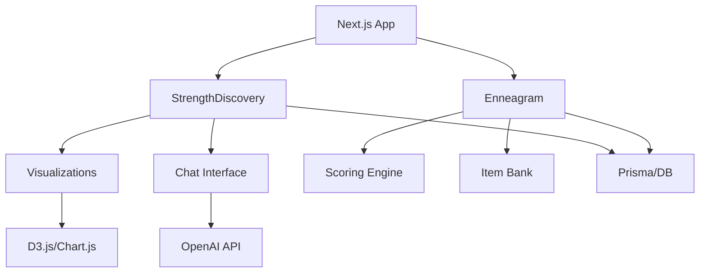

# LifeCraft Modules Code Map

## Overview
This document provides a complete mapping of all module-related code across the LifeCraft application.

## Module Locations

### StrengthDiscovery Module

| Component | Current Location | Purpose |
|-----------|-----------------|---------|
| **Frontend Pages** | `/lifecraft-bot/src/app/discover/strengths/` | Main strength discovery UI |
| **Visualizations** | `/lifecraft-bot/src/components/visualization/` | Strength visualization components |
| **API Routes** | `/lifecraft-bot/src/app/api/chat/` | Strength-related API endpoints (integrated with chat) |
| **Core Logic** | TBD - `/lifecraft-bot/src/lib/strengths/` | Business logic (to be extracted) |
| **Database Schema** | `/Modules/StrengthDiscovery/database-schema.sql` | PostgreSQL schema definition |
| **Documentation** | `/lifecraft-bot/docs/strength_discovery_conversation_flow.md` | Conversation flow docs |

#### Key Files
- `StrengthRadarChart.tsx` - Radar chart visualization
- `StrengthHexagon.tsx` - Hexagonal strength display  
- `StrengthMindMap.tsx` - Mind map visualization
- `ChatInterface.tsx` - Main chat interface using strengths

### Enneagram Module

| Component | Current Location | Purpose |
|-----------|-----------------|---------|
| **Frontend Pages** | `/lifecraft-bot/src/app/discover/enneagram/` | Enneagram assessment UI |
| **API Routes** | `/lifecraft-bot/src/app/api/enneagram/` | Enneagram API endpoints |
| **Core Logic** | `/lifecraft-bot/src/lib/enneagram/` | Assessment and scoring logic |
| **Database Schema** | `/Modules/Enneagram/database-schema.sql` | PostgreSQL schema definition |
| **Visualizations** | TBD | Enneagram visualizations (to be created) |

#### Key Files
- `scoring.ts` - Type scoring algorithms
- `discriminators.ts` - Type discrimination logic
- `itemBank.ts` - Assessment questions database
- `instincts.ts` - Instinctual variants logic
- `answer/route.ts` - Process assessment responses
- `score/route.ts` - Calculate type scores
- `export/route.ts` - Export results
- `items/route.ts` - Retrieve questions

## Shared Components

| Component | Location | Used By |
|-----------|----------|---------|
| **Prisma Client** | `/lifecraft-bot/src/lib/prisma.ts` | All modules |
| **Chat Interface** | `/lifecraft-bot/src/components/ChatInterface.tsx` | StrengthDiscovery |
| **Results Page** | `/lifecraft-bot/src/app/results/page.tsx` | Both modules |
| **Session Management** | `/lifecraft-bot/src/app/api/session/` | Both modules |

## Configuration Files

| File | Location | Purpose |
|------|----------|---------|
| **TypeScript Config** | `/lifecraft-bot/tsconfig.json` | Path mappings (@/* alias) |
| **Package.json** | `/lifecraft-bot/package (1).json` | Dependencies and scripts |
| **Prisma Schema** | `/lifecraft-bot/prisma/schema.prisma` | Database models |
| **Environment** | `/lifecraft-bot/.env.local` | API keys and database URLs |

## Import Path Mappings

### Current Structure
```typescript
// TypeScript alias mapping
"@/*": ["./src/*"]

// Example imports
import { ChatInterface } from '@/components/ChatInterface';
import { scoring } from '@/lib/enneagram/scoring';
import { prisma } from '@/lib/prisma';
```

### Module Imports
```typescript
// StrengthDiscovery imports
import { StrengthRadarChart } from '@/components/visualization/StrengthRadarChart';
import { StrengthHexagon } from '@/components/visualization/StrengthHexagon';

// Enneagram imports  
import { getScreenerItems } from '@/lib/enneagram/itemBank';
import { calculateTypeScores } from '@/lib/enneagram/scoring';
import { getDiscriminator } from '@/lib/enneagram/discriminators';
```

## API Endpoint Structure

### StrengthDiscovery Endpoints (Planned)
```
/api/strength/
├── assessment/
│   ├── start/        # POST - Start assessment
│   ├── answer/       # POST - Submit answer
│   └── results/      # GET - Get results
├── profile/          # GET - User profile
├── insights/         # GET - Personalized insights
└── export/           # GET - Export data
```

### Enneagram Endpoints (Current)
```
/api/enneagram/
├── items/            # GET - Get questions
├── answer/           # POST - Submit answers
├── score/            # POST - Calculate scores
└── export/           # GET - Export results
```

## Database Tables

### StrengthDiscovery Tables
- `strength_categories` - Strength category definitions
- `strengths` - Individual strength catalog
- `user_strengths` - User's identified strengths
- `strength_assessments` - Assessment history
- `strength_insights` - Generated insights
- `strength_goals` - Development goals

### Enneagram Tables
- `enneagram_types` - Type definitions
- `enneagram_sessions` - Assessment sessions
- `user_enneagram_profiles` - User type profiles
- `enneagram_questions` - Question bank
- `enneagram_insights` - Type-based insights
- `type_relationships` - Inter-type dynamics

## Build and Deploy Paths

### Development
```bash
# Working directory
/Volumes/External SSD/Projects/Research/WFED119/lifecraft-bot

# Start development
pnpm dev

# Module pages
http://localhost:3000/discover/strengths
http://localhost:3000/discover/enneagram
```

### Production Build
```bash
# Build command
pnpm build

# Output directory
/lifecraft-bot/.next/

# Static assets
/lifecraft-bot/public/
```

## Module Dependencies Graph



## File Naming Conventions

### Components
- PascalCase: `StrengthRadarChart.tsx`
- Prefix with module: `EnneagramTypeWheel.tsx`

### Utilities/Logic
- camelCase: `scoring.ts`, `itemBank.ts`
- Descriptive names: `discriminators.ts`

### API Routes
- Folder-based: `/api/[module]/[action]/route.ts`
- RESTful naming: `items`, `answer`, `score`

### Database
- snake_case: `user_strengths`, `enneagram_types`
- Prefixed tables: `strength_*`, `enneagram_*`

## Module Boundaries

### Clear Separation
- **UI Layer**: `/app/discover/[module]/`
- **API Layer**: `/app/api/[module]/`
- **Logic Layer**: `/lib/[module]/`
- **Data Layer**: Prisma models

### Shared Resources
- Database connection
- Authentication
- Common UI components
- Utility functions

## Future Module Structure

### Proposed Organization
```
/Modules/
├── StrengthDiscovery/
│   ├── src/
│   ├── tests/
│   ├── docs/
│   └── package.json
├── Enneagram/
│   ├── src/
│   ├── tests/
│   ├── docs/
│   └── package.json
└── Shared/
    ├── components/
    ├── utils/
    └── types/
```

### Migration Path
1. Extract core logic to `/lib/[module]/`
2. Create module-specific components
3. Implement module APIs
4. Move to `/Modules/` structure
5. Implement as workspace packages