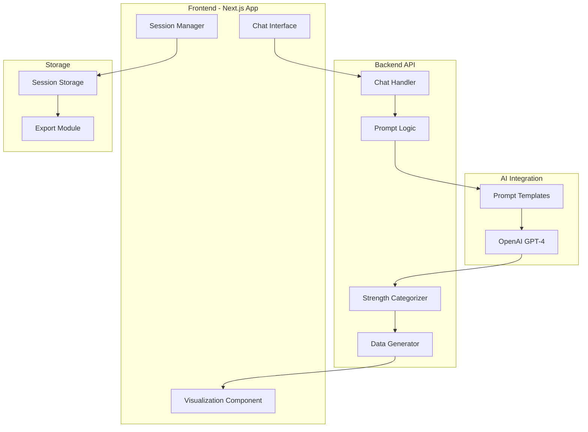
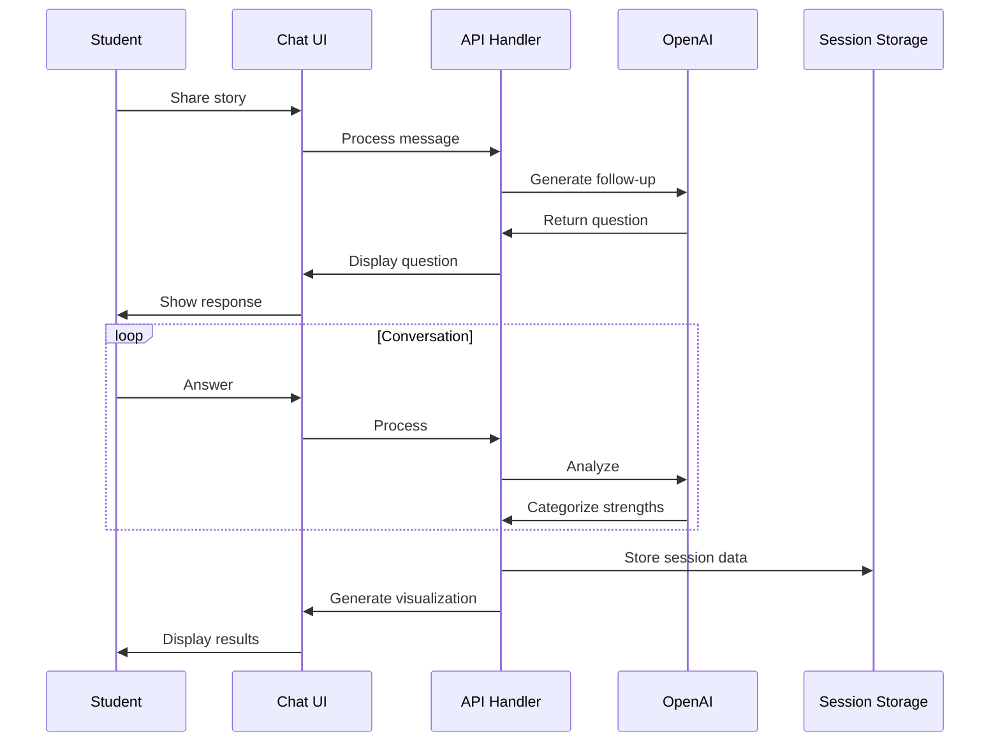

# Lifecraft Strength Discovery Bot - Architecture Plan

## Overview
An AI-powered chatbot for WFED 119 students to discover their strengths through storytelling, based on the LifeCraft methodology (pages 46-50).

## System Architecture



## Core Components

### 1. Conversation Flow Manager
Based on LifeCraft methodology:
- Initial prompt: "일을 하면서 굉장히 만족감을 느꼈던 순간을 떠올려보세요..."
- Progressive questioning to explore the story
- Socratic method implementation

### 2. Strength Analysis Engine
Categories from the book:
- **Values (가치)**: Core beliefs and principles
- **Attitudes (태도)**: Behavioral tendencies and approaches
- **Competencies (역량)**: Skills and abilities

### 3. Visualization System
- Mindmap-style categorization (similar to page 48)
- Interactive strength clustering
- Exportable results

## Theoretical Framework Integration

### From Syllabus References:
1. **Bandura's Human Agency Theory**
   - Self-reflectiveness
   - Forethought
   - Intentionality
   - Self-reactiveness

2. **Hope-Action Theory (Niles et al.)**
   - Goal setting
   - Pathway thinking
   - Agency thinking

3. **Career Construction Theory (Savickas)**
   - Life themes
   - Vocational personality
   - Career adaptability

## Implementation Phases

### Phase 1: MVP (Current Focus)
- Basic chat interface
- Core strength discovery flow
- Simple categorization
- Basic visualization
- Session-only storage

### Phase 2: Enhancement
- Advanced Socratic questioning
- Multi-language support (Korean/English)
- Interactive visualizations
- Persistent storage with encryption

### Phase 3: Full Integration
- Integration with other WFED 119 tools
- Comprehensive reporting
- Instructor dashboard
- Analytics and insights

## Prompt Engineering Strategy

### Initial Prompt Template
```
You are a career counselor trained in the LifeCraft methodology. 
Guide the student through a strength discovery interview following these steps:

1. Ask them to recall a moment of great satisfaction from work/activity
2. Explore what they did, how they did it, and what they felt
3. Use Socratic questioning to uncover deeper patterns
4. Identify strengths in three categories: Values, Attitudes, Competencies
5. Help them recognize patterns and themes

Remember to:
- Be empathetic and encouraging
- Ask follow-up questions based on their responses
- Look for underlying motivations and drivers
- Connect their story to broader life themes
```

### Dynamic Questioning Logic
- Contextual follow-ups based on student responses
- Depth exploration when key themes emerge
- Pattern recognition across multiple stories

## Technical Stack

### Frontend
- **Framework**: Next.js 14 with App Router
- **UI Library**: Tailwind CSS + shadcn/ui
- **State Management**: Zustand
- **Visualization**: D3.js or Chart.js

### Backend
- **API Routes**: Next.js API Routes
- **AI Integration**: OpenAI SDK
- **Data Processing**: TypeScript
- **Validation**: Zod

### Deployment
- **Platform**: Vercel
- **Environment**: Edge Functions
- **Monitoring**: Vercel Analytics

## Data Flow



## Security & Privacy

### Data Handling
- Session-only storage by default
- No PII stored without consent
- Encrypted transmission
- Auto-deletion after session

### API Security
- Rate limiting
- API key management via environment variables
- Request validation
- CORS configuration

## User Experience Flow

1. **Welcome Screen**
   - Introduction to the activity
   - Privacy notice
   - Begin button

2. **Story Sharing**
   - Initial prompt display
   - Text input area
   - Submit button

3. **Interactive Interview**
   - AI-generated follow-up questions
   - Contextual prompts
   - Progress indicator

4. **Strength Analysis**
   - Processing animation
   - Categorization display
   - Pattern identification

5. **Results Visualization**
   - Interactive strength map
   - Category breakdown
   - Export options

6. **Reflection & Next Steps**
   - Summary of findings
   - Connection to course objectives
   - Save/export results

## Integration Points

### With WFED 119 Course
- Week 1 activity (Strength finding)
- Links to Enneagram results (Week 2)
- Feeds into Mission Statement (Week 5)
- Connects to Vision Statement (Week 7)

### With LifeCraft Methodology
- Follows interview structure from pages 46-50
- Uses categorization framework
- Implements reflection questions
- Maintains theoretical alignment

## Success Metrics

### Technical
- Response time < 2 seconds
- 99% uptime
- Error rate < 1%

### Educational
- Completion rate > 80%
- Student satisfaction > 4/5
- Meaningful strength identification
- Actionable insights generated

## Next Steps

1. Set up development environment
2. Create basic UI components
3. Implement chat functionality
4. Integrate OpenAI API
5. Build strength analysis logic
6. Create visualization components
7. Test with sample data
8. Deploy to Vercel
9. Gather feedback
10. Iterate and improve